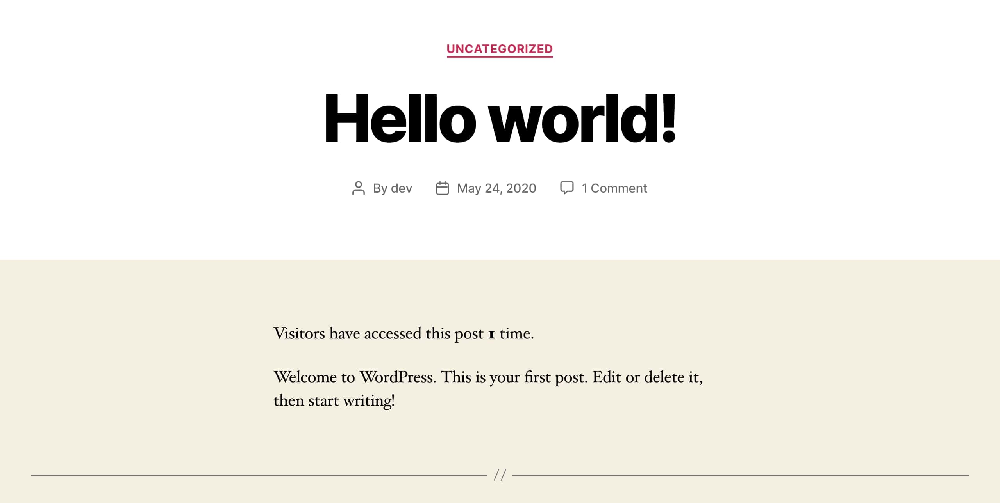

# Posts Unique View Counter
[](https://wordpress.org/plugins/posts-unique-view-counter/)
[](LICENSE)
[](https://github.com/dcangulo/posts-unique-view-counter/pulls)
[](https://wordpress.org/support/plugin/posts-unique-view-counter/reviews/#new-post)

Easily count unique views of your posts.

Just install the plugin and the counting begins. No coding skills needed.

## How does it work?
* All views of the post will start at zero (0) upon the plugin installation.
* When a visitor viewed your post, it will save a cookie on the visitor so that same visitor will only count as one (1) view, this way we can uniquely identify each visitor.
* The cookie expires after a month, so if the same person viewed your post after the cookie expires it will count as another view.
* Visitors who use "incognito" or something similar will be counted always as a unique visitor because "incognito" mode does not save cookies.
* One (1) visitor = One (1) cookie.

Please rate and review the plugin if you find it useful.

Find my other works here: [https://www.davidangulo.xyz/portfolio/](https://www.davidangulo.xyz/portfolio/)

## Installation

1. In your WordPress admin menu, hover to **Plugins** and click **Add New**.
2. Enter **Posts Unique View Counter** in the searchbox.
3. Find the plugin entitled **Posts Unique View Counter** by **David Angulo** then click **Install Now**.
4. Click **Activate** once the plugin is installed.

## Installation using Composer
```
composer require wpackagist-plugin/posts-unique-view-counter
```

## Frequently Asked Questions

Do you have any question/s? You may contact me using the email [hello@davidangulo.xyz](mailto:hello@davidangulo.xyz)

## Screenshots

1. [Posts Unique View Counter running on Twenty Twenty theme](assets/screenshot-1.jpg).
2. [Posts list page with view column](assets/screenshot-2.jpg).
3. [Posts Unique View Counter settings](assets/screenshot-3.jpg).

## License
Copyright © 2020 David Angulo, released under the GPL2 license, see [LICENSE](LICENSE).
